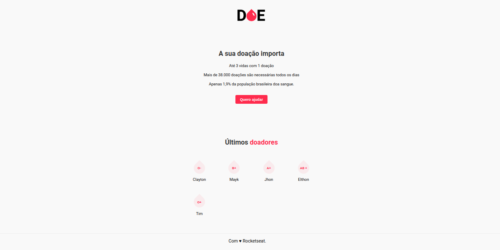
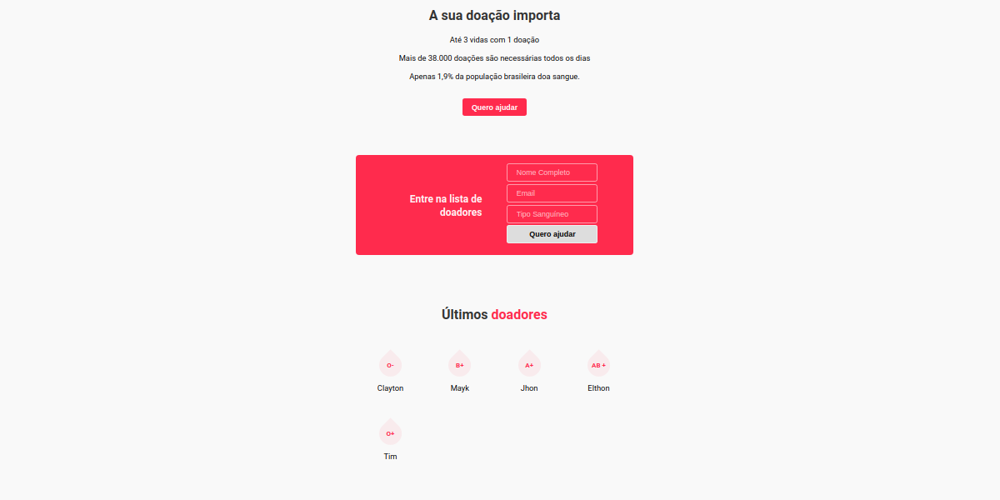
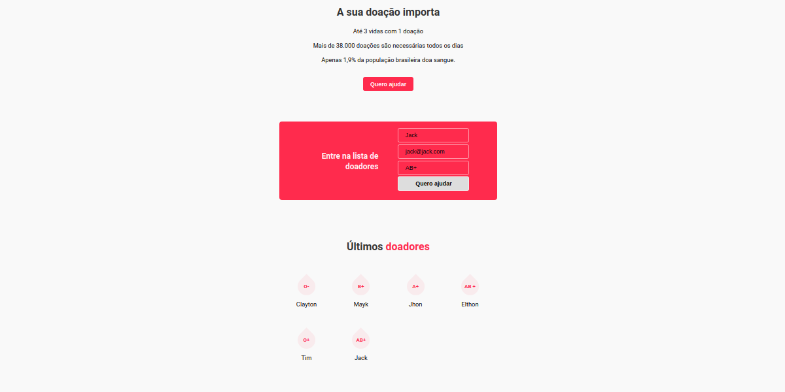
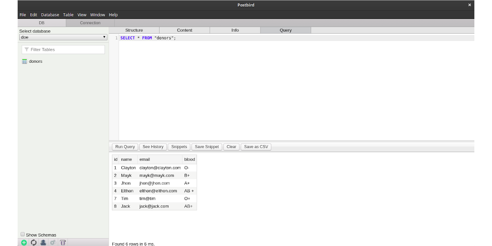

# 
## Um sistema de cadastro de doadores de sangue
### Aplicação web criada a partir da 3ª MaratonaDev da Rocketseat, evento online ocorrido gratuitamente durante os dias 17 e 18 de Fevereiro de 2020
### Instrutor: [Mayk Brito](https://github.com/maykbrito)

## Tecnologias
### Front-end
- **HTML5**
- **CSS3**
- **JS**
### Back-end
- **JS**
- **Servidor Node.js**
  - Com as dependências **Express, Nodemon e Nunjucks**
- **Banco de Dados Postgres**

## Dependências

Instaladas através do npm, o **express** (para o servidor web), o **nodemon** (para escutar os arquivos e diretórios, sem precisar reiniciar o nodejs a cada alteração) e o **nunjucks** (para organizar e manipular os conteúdos HTML de forma dinâmica, através de templates engines).

### Banco de dados Postgres
Ligação através do cliente PostgreSQL para node.

`npm install pg`

Foi criado um banco chamado "**doe**", com uma tabela "**donors**" e com as linhas **id**, **name**, **email** e **blood**.

## Para rodar a aplicação

`npm start`

O terminal deve retornar: "Servidor iniciado."

Acesso via **localhost:3000**

## Interface

Visualização inicial da página

---

Ao clicar no botão

---

Cadastramento de um novo doador e visualização na lista de últimos doadores

---

Visualização no postbird dos doadores cadastrados no banco de dados postgres

## Licença
[MIT](https://github.com/christyanbrayan/doe/blob/master/LICENSE)
